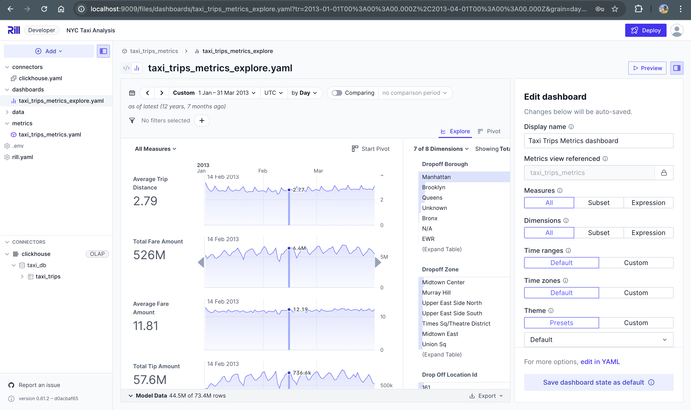

# NYC Taxi Data Pipeline with PySpark and Rill Dashboard

This project implements an end-to-end data pipeline for processing NYC Taxi data using PySpark, orchestrated by Apache Airflow, ingested into Clickhouse and visualized through a Rill dashboard. The complete problem statement is described below:

[https://rilldata.notion.site/Coding-Challenge-Data-Pipeline-with-Dashboard-Visualization-1b4ba33c8f5780ac86cfe397ec3cc530](https://rilldata.notion.site/Coding-Challenge-Data-Pipeline-with-Dashboard-Visualization-1b4ba33c8f5780ac86cfe397ec3cc530)


## Project Structure

```
coding_challenge/
   ├── airflow/             # Airflow DAGs and configurations
   ├── spark/               # PySpark jobs and transformations
   ├── clickhouse/          # Data Store
   ├── data/                # Data storage
   ├── config/              # Configuration files
   ├── scripts/             # Utility scripts
my-rill-project/            
    ├── models/             # Data models and transformations for Rill
    ├── dashboards/         # Dashboard configurations and layouts
    ├── connectors/         # Clickhouse connection configurations
    └── metrics/            # Metrics and Dimensions defined
```

## Setup Instructions

1. Install Docker and Docker Compose
   [https://docs.docker.com/desktop/setup/install/mac-install/](https://docs.docker.com/desktop/setup/install/mac-install/)

   Once done, confirm that docker is up and running:
   ```bash
   docker --version && docker-compose --version
   ```

2. Create necessary directories:
   ```bash
   cd coding_challenge && mkdir -p airflow/dags airflow/logs airflow/plugins data/raw data/processed spark/jobs spark/transformations spark/utils spark/tests rill/models rill/dashboards config clickhouse/data && chmod 777 clickhouse/data
   ```

3. Set up a Python virtual environment and install the requirements:
   ```bash
   python3 -m venv venv && source venv/bin/activate && pip install -r requirements.txt
   ```

4. Start the services:
   ```bash
   docker-compose up -d
   ```

5. Setup Rill
   ```bash
   # Install Rill CLI
   cd ../ && curl https://rill.sh | sh

   # Start Rill server
    ./rill start my-rill-project
   ```

   Note: The project already includes pre-configured Rill dashboards and connectors, so no additional setup is required.


7. Access the services:
   - Airflow UI: [http://localhost:8080](http://localhost:8080)
      - User: `airflow`
      - Password: `airflow`
   - Spark UI: [http://localhost:8082](http://localhost:8082)
   - Rill Dashboard: [http://localhost:9009](http://localhost:9009)
   - ClickHouse:  [http://localhost:8123](http://localhost:8123)
      - SQL Playground: [http://localhost:8123/play](http://localhost:8123/play)
      - Native Interface: localhost:9000
      - Database: `taxi_db`
      - User: `default`
      - Password: `clickhouse`

8. Verify if our Clickhouse table exists
   - Open SQL Playground: [http://localhost:8123/play](http://localhost:8123/play)
   - Enter username and password on the top right.
   - Run the following query to verify the table exists:
     ```sql
     SELECT * FROM taxi_db.taxi_trips;
     ```
   - In case the table doesn't exist, run the query under the following file. *This automation needs to be fixed*
     ```bash
     coding_challenge/clickhouse/init/01_init.sql
     ```
   - Make sure the table exists before running the pipeline.

9. Running the Pipeline
   - Open Airflow UI [http://localhost:8080](http://localhost:8080) and trigger DAG `nyc_taxi_pipeline_ingestion`


10. Dashboard
   - Uses Rill to power analytics dashboards [http://localhost:9009](http://localhost:9009)
   - Uses existing Clickhouse connection defined under `my-rill-project/connectors/clickhouse.yaml`
   - Defined simple metrics like total_trips, avg trip distance etc and dimensions like pickup zone, hour_of_day, payment_type etc under `my-rill-project/metrics/taxi_trips_metrics.yaml` file.
   - Created a simple dashboard under `my-rill-project/dashboards/taxi_trips_metrics_explore.yaml`
   - Here's how the dashboard looks like

